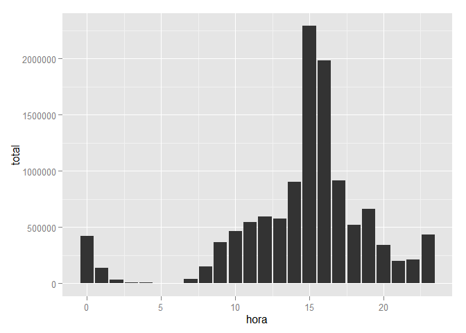
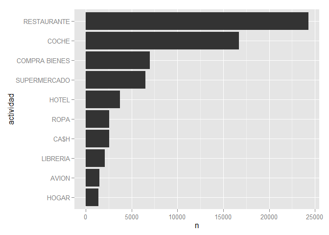
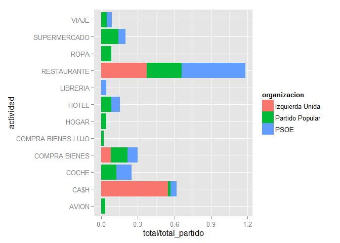
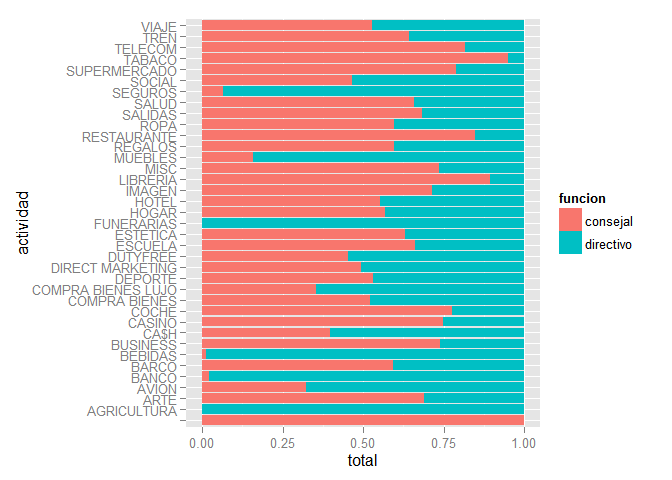
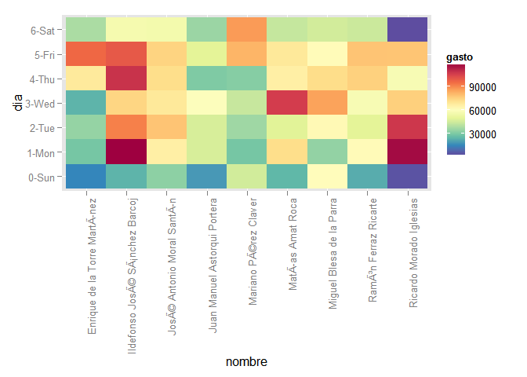
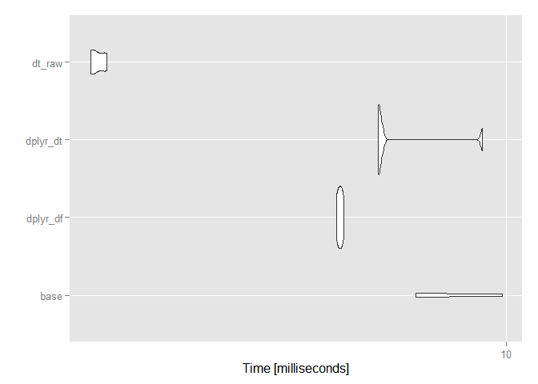
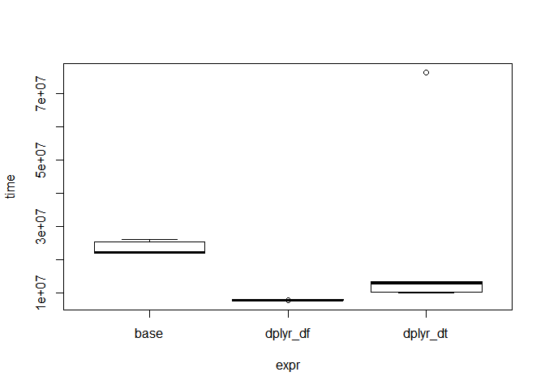

Tutorial dplyr
==============

### Introducción

#### ¿Que es **dplyr**?

**[dplyr](https://github.com/hadley/dplyr)** es una librería de funciones para analizar y manipular datos: dividir grandes colecciones de datos, aplicar una función a cada parte y re-agrupar las, y también aplicar filtros, ordenar y juntar datos. Es una evolución del paquete **[plyr](http://plyr.had.co.nz/)**: es más rápido, capaz de trabajar sobre datos remotos y solo trabaja sobre data.frames.

Como lo presenta su autor, Hadley Wickham, **[dplyr](https://github.com/hadley/dplyr)** es la *nueva* iteración del paquete **plyr**, enfocado a las **data.frames**, con 3 objetivos:

-   identificar cual son las manipulaciones más importantes para analizar datos y hacerlas fáciles con R.

-   escribir las partes-llaves en [C++](http://www.rcpp.org/) para manipular los datos en memoria muy rápidamente.

-   usar las misma interfaces para trabajar donde sea los datos: data frame, data table o database.

#### objetivo del tutorial

-   entender los conceptos básicos de **dplyr**
-   aprender su *gramática*
-   saber con que objetos puede trabajar

Trabajaremos sobre los siguientes datos:

-   los movimientos de las tristemente famosas *tarjetas black* de Caja Madrid


**Requerimientos**: Es necesario un conocimiento básico de R y saber como instalar paquetes.

> La integralidad de este tutorial esta en un repositorio público de Github: <http://github.com/fdelaunay/tutorial-dplyr-es> ¡Cualquier colaboración/correción esta bienvenida!

#### Documentación

Documentación del paquete (una vez instalado):

``` r
??dplyr
```

Tutoriales en inglés:

-   Vignette: [*Inroduction to dplyr*](http://cran.rstudio.com/web/packages/dplyr/vignettes/introduction.html)
-   Video: [*dplyr presentado por Hadley*](http://datascience.la/hadley-wickhams-dplyr-tutorial-at-user-2014-part-1/)

#### Instalación y cargamento

Este tutorial fue escrito con la versión `0.4.1` de **dplyr**.

    ## Warning: package 'dplyr' was built under R version 3.1.3

#### Los datos

El paquete "**tarjetasblack**" contiene dos objetos:

1.  La tabla `movimientos`, una data.frame que lista todos los movimientos realizados, el importe, la fecha y hora, el nombre del comercio y una clasificación del tipo de actividad.
2.  La table `miembros`, otra data.frame que lista los proprietarios de tarjeta, su función (consejal o directivo) así que la organisación de origen (partido politico o sindicato).

``` r
devtools::install_github("splatsh/tarjetasblack")
library(tarjetasblack)
```

``` r
str(movimientos)
```

    ## 'data.frame':    77202 obs. of  8 variables:
    ##  $ nombre            : Factor w/ 83 levels "Alberto Recarte García Andrade",..: 1 1 1 1 1 1 1 1 1 1 ...
    ##  $ fecha             : POSIXct, format: "2003-01-04" "2003-01-04" ...
    ##  $ hora              : int  12 12 19 15 16 15 10 12 15 15 ...
    ##  $ minuto            : int  30 32 7 31 5 27 20 58 25 28 ...
    ##  $ importe           : num  38.7 14.6 95.6 49.1 13.9 ...
    ##  $ comercio          : chr  "RCG OFICINA                   " "MANZANIL AREA                 " "REST REAL C GOLF SOTOGRAN     " "ESTACONES DE SERVICIO ML      " ...
    ##  $ actividad_completa: chr  "CONFECCION TEXTIL EN GENERAL" "HOTELES,MOTELES,BALNEARIOS,CAMPINGS REST" "RESTAURANTES RESTO" "GASOLINERAS" ...
    ##  $ actividad         : Factor w/ 37 levels "","AGRICULTURA",..: 28 21 27 11 11 21 11 12 27 11 ...

``` r
str(miembros)
```

    ## 'data.frame':    83 obs. of  3 variables:
    ##  $ funcion     : Factor w/ 2 levels "consejal","directivo": 1 1 1 1 1 1 1 1 1 1 ...
    ##  $ nombre      : Factor w/ 83 levels "Alberto Recarte García Andrade",..: 1 2 3 4 5 6 7 8 9 10 ...
    ##  $ organizacion: Factor w/ 11 levels "","CC OO","CEIM",..: 8 3 10 7 8 2 10 3 8 8 ...

### Fuentes de datos

#### Clase `tbl`

**dplyr** trabaja con objeto de la clase `tbl` (dato con estructura tabular). Es capaz de convertir automaticamente varios tipos de fuente de datos, que sean locales o lejanas (bases de datos).

#### Data frames

``` r
# data frame
head(miembros)
##    funcion                                   nombre    organizacion
## 1 consejal          Alberto Recarte García Andrade Partido Popular
## 2 consejal                 Alejandro Couceiro Ojeda            CEIM
## 3 consejal Ángel Eugenio Gómez del Pulgar Perales            PSOE
## 4 consejal                 Angel Rizaldos González Izquierda Unida
## 5 consejal                  Antonio Cámara Eguinoa Partido Popular
## 6 consejal  Antonio Rey de Viñas Sánchez-Majestad           CC OO

# convertimos a la clase "tbl"
miembros <- tbl_df(miembros)

# los objetos "tbl" son mas facil de visualisar en la consola:
miembros
## Source: local data frame [83 x 3]
## 
##     funcion                                   nombre    organizacion
## 1  consejal          Alberto Recarte García Andrade Partido Popular
## 2  consejal                 Alejandro Couceiro Ojeda            CEIM
## 3  consejal Ángel Eugenio Gómez del Pulgar Perales            PSOE
## 4  consejal                 Angel Rizaldos González Izquierda Unida
## 5  consejal                  Antonio Cámara Eguinoa Partido Popular
## 6  consejal  Antonio Rey de Viñas Sánchez-Majestad           CC OO
## 7  consejal                   Antonio Romero Lázaro            PSOE
## 8  consejal          Arturo Luis Fernández Álvarez            CEIM
## 9  consejal              Beltrán Gutiérrez Moliner Partido Popular
## 10 consejal                 Cándido Cerón Escudero Partido Popular
## ..      ...                                      ...             ...

glimpse(miembros) # parecido a str()
## Observations: 83
## Variables:
## $ funcion      (fctr) consejal, consejal, consejal, consejal, consejal...
## $ nombre       (fctr) Alberto Recarte García Andrade, Alejandro Couce...
## $ organizacion (fctr) Partido Popular, CEIM, PSOE, Izquierda Unida, Pa...
```

#### Data table

**dplyr** permite trabajar con [**data tables**](http://datatable.r-forge.r-project.org/).

Pro:

-   *a priori* beneficiamos de la alta rapidez de las **data tables**
-   la sintaxis es mucho más simple que con el operador `[`

Contra:

-   para operaciones multiples (por ejemplo seleción + nueva variable), usar directamente las **data.table**s pueden ser más eficazes.
-   si buscamos rapidez pura, usaremos **data tables**

Convertimos los movimientos (77207 observaciones) en un objeto data table:

    ## 
    ## Attaching package: 'data.table'
    ## 
    ## The following objects are masked from 'package:dplyr':
    ## 
    ##     between, last

#### Bases de datos

**dplyr** tambien puede trabajar con bases de datos de forma casi transparente:

-   SQLite
-   PostgreSQL/Redshift
-   MySQL/MariaDB
-   Bigquery
-   MonetDB

Más información [aquí](http://cran.r-project.org/web/packages/dplyr/vignettes/databases.html) (inglés).

### Los verbos

> "En el principio existía el Verbo"

-   `select()`: seleccionar columnas por nombre
-   `filter()`: suprimir las filas que no respectan una condición (+`slice()`: filtraje por posición)
-   `arrange()`: ordenar filas
-   `mutate()`: añade nuevas variables (con `group_by()`)
-   `summarise()`: agrupar valores (con `group_by()`)

¿como funciona?

-   primer argumento es una data.frame
-   los siguientes argumentos dicen que hacer con los datos
-   siempre devuelve otra data.frame

#### Seleccionar columnas con `select()`

Cuanto tenéis un objeto con muchas columnas, puede ser útil usar `select()` para reducir este número:

``` r
# todas las columnas menos 'funcion'
select(miembros, -funcion)
# las columnas entre 'nombre' y 'fecha'
select(movimientos, nombre:fecha)
# las columns con 'om'
select(movimientos, contains("om"))
# las columnas que empiezan por 'nom'
select(movimientos, starts_with("nom"))
# las columnas que respectan una expresión regular
select(movimientos, matches("?uto"))
```

> equivalente en SQL: `SELECT`

``` r
# guardamos esta versión simplifacada de 'movimientos' renombrando las columnas
mov <- select(movimientos, nom = nombre, imp =  importe, act = actividad)
```

#### Filtrar registros con `filter()`

`filter()` permite filtrar los registros. El primer argumento es el nombre del data frame. El segundo y los siguientes son expreciones logicas que serán evaluadas en el contexto del data frame:

``` r
filter(miembros, organizacion %in% c("PSOE", "Partido Popular"))
## Source: local data frame [42 x 3]
## 
##     funcion                                   nombre    organizacion
## 1  consejal          Alberto Recarte García Andrade Partido Popular
## 2  consejal Ángel Eugenio Gómez del Pulgar Perales            PSOE
## 3  consejal                  Antonio Cámara Eguinoa Partido Popular
## 4  consejal                   Antonio Romero Lázaro            PSOE
## 5  consejal              Beltrán Gutiérrez Moliner Partido Popular
## 6  consejal                 Cándido Cerón Escudero Partido Popular
## 7  consejal    Rafael Darío Fernández Yruegas Moro Partido Popular
## 8  consejal    Estanislao Rodríguez-Ponga Salamanca Partido Popular
## 9  consejal                  Fernando Serrano Antón Partido Popular
## 10 consejal             Francisco José Moure Bourio Partido Popular
## ..      ...                                      ...             ...
filter(miembros, grepl("Antonio", nombre))
## Source: local data frame [4 x 3]
## 
##    funcion                                  nombre    organizacion
## 1 consejal                 Antonio Cámara Eguinoa Partido Popular
## 2 consejal Antonio Rey de Viñas Sánchez-Majestad           CC OO
## 3 consejal                  Antonio Romero Lázaro            PSOE
## 4 consejal             José Antonio Moral Santín Izquierda Unida
filter(movimientos, importe > 10000)
## Source: local data table [10 x 8]
## 
##                                  nombre      fecha hora minuto  importe
## 1  Ricardo Romero de Tejada y Picatoste 2007-11-26   10     59 11930.00
## 2       Ildefonso José Sánchez Barcoj 2006-02-15    9     13 11000.00
## 3       Ildefonso José Sánchez Barcoj 2009-12-31    2     40 16921.76
## 4              Miguel Blesa de la Parra 2006-04-05   16     51 12597.27
## 5              Miguel Blesa de la Parra 2006-07-20   14     50 13148.30
## 6                 Ramón Ferraz Ricarte 2007-12-20   14      9 13549.00
## 7                     Matías Amat Roca 2006-12-27   17      6 15000.00
## 8                     Matías Amat Roca 2008-11-12   12     16 10400.00
## 9         Enrique de la Torre Martínez 2007-11-29    9     57 12000.00
## 10        Enrique de la Torre Martínez 2008-03-07   16      1 11075.00
## Variables not shown: comercio (chr), actividad_completa (chr), actividad
##   (fctr)
filter(movimientos, importe > 10000 & hora < 4)
## Source: local data table [1 x 8]
## 
##                            nombre      fecha hora minuto  importe
## 1 Ildefonso José Sánchez Barcoj 2009-12-31    2     40 16921.76
## Variables not shown: comercio (chr), actividad_completa (chr), actividad
##   (fctr)
```

Para selecionar registros por posición, usar `slice()`:

``` r
slice(miembros, 50:55)
```

    ## Source: local data frame [6 x 3]
    ## 
    ##    funcion                       nombre    organizacion
    ## 1 consejal   Miguel Ángel Abejón Resa             UGT
    ## 2 consejal Miguel Ángel Araujo Serrano Partido Popular
    ## 3 consejal        Miguel Corsini Freese Partido Popular
    ## 4 consejal  Miguel Muñiz de las Cuevas            PSOE
    ## 5 consejal         Pablo Abejas Juárez Partido Popular
    ## 6 consejal           Pedro Bedia Pérez           CC OO

> equivalente en SQL: `WHERE`

#### Sortear registros con `arrange()`

`arrange()` permite sortear los registros por una o varias columnas:

``` r
arrange(miembros, desc(organizacion), nombre)
```

    ## Source: local data frame [83 x 3]
    ## 
    ##     funcion                                   nombre organizacion
    ## 1  consejal                  Gonzalo Martín Pascual          UGT
    ## 2  consejal           José Ricardo Martínez Castro          UGT
    ## 3  consejal               Miguel Ángel Abejón Resa          UGT
    ## 4  consejal             Rafael Eduardo Torres Posada          UGT
    ## 5  consejal Ángel Eugenio Gómez del Pulgar Perales         PSOE
    ## 6  consejal                   Antonio Romero Lázaro         PSOE
    ## 7  consejal        Francisco José Pérez Fernández         PSOE
    ## 8  consejal                     Ignacio Varela Díaz         PSOE
    ## 9  consejal                  Joaquín García Pontes         PSOE
    ## 10 consejal                      Jorge Gómez Moreno         PSOE
    ## ..      ...                                      ...          ...

`top_n` es una combinación de sorteo + filtro:

``` r
top_n(mov, 2, imp)
## Source: local data table [2 x 3]
## 
##                               nom      imp           act
## 1 Ildefonso José Sánchez Barcoj 16921.76 COMPRA BIENES
## 2               Matías Amat Roca 15000.00         HOGAR
top_n(miembros, 1) # por defecto, ordena por la ultima columna
## Selecting by organizacion
## Source: local data frame [4 x 3]
## 
##    funcion                         nombre organizacion
## 1 consejal   Rafael Eduardo Torres Posada          UGT
## 2 consejal        Gonzalo Martín Pascual          UGT
## 3 consejal José Ricardo Martínez Castro          UGT
## 4 consejal     Miguel Ángel Abejón Resa          UGT
```

> equivalente en SQL: `ORDER BY`

#### Agregar y transformar con `group_by`, `summarise()` y `mutate()`

`summarise()` agrega los datos por groupos creados por `group_by()`. Si no estan agrupados, agrupa todo en un solo registro.

``` r
summarise(movimientos, max(importe))
## Source: local data table [1 x 1]
## 
##   max(importe)
## 1     16921.76
summarise(group_by(mov, nom), max_personal = max(imp))
## Source: local data table [83 x 2]
## 
##                                         nom max_personal
## 1           Alberto Recarte García Andrade      3509.20
## 2                  Alejandro Couceiro Ojeda      1150.00
## 3  Ángel Eugenio Gómez del Pulgar Perales      4906.00
## 4                  Angel Rizaldos González       843.00
## 5                   Antonio Cámara Eguinoa      2742.00
## 6   Antonio Rey de Viñas Sánchez-Majestad      1751.08
## 7                    Antonio Romero Lázaro      4500.00
## 8           Arturo Luis Fernández Álvarez      2550.00
## 9               Beltrán Gutiérrez Moliner      2439.50
## 10                 Cándido Cerón Escudero      2800.00
## ..                                      ...          ...
summarise(group_by(miembros, organizacion), n())
## Source: local data frame [11 x 2]
## 
##            organizacion n()
## 1                        19
## 2                 CC OO   6
## 3                  CEIM   3
## 4                  CEOE   1
## 5  Comisión de Control   1
## 6      Conf. de Cuadros   1
## 7       Izquierda Unida   5
## 8       Partido Popular  27
## 9    Patronal (Unipyme)   1
## 10                 PSOE  15
## 11                  UGT   4
```

`mutate()` es muy similar. La diferencia es que `mutate()` no dismimue el número de filas pero añade columnas con el resultado de la agregación:

``` r
mutate(mov, total = sum(imp))
## Source: local data table [77,202 x 4]
## 
##                                nom    imp           act    total
## 1  Alberto Recarte García Andrade  38.70          ROPA 11806773
## 2  Alberto Recarte García Andrade  14.60         HOTEL 11806773
## 3  Alberto Recarte García Andrade  95.62   RESTAURANTE 11806773
## 4  Alberto Recarte García Andrade  49.13         COCHE 11806773
## 5  Alberto Recarte García Andrade  13.94         COCHE 11806773
## 6  Alberto Recarte García Andrade  80.00         HOTEL 11806773
## 7  Alberto Recarte García Andrade  53.37         COCHE 11806773
## 8  Alberto Recarte García Andrade  42.00 COMPRA BIENES 11806773
## 9  Alberto Recarte García Andrade 263.30   RESTAURANTE 11806773
## 10 Alberto Recarte García Andrade   2.10         COCHE 11806773
## ..                             ...    ...           ...      ...
mutate(group_by(mov, nom), total_personal = sum(imp), pp = imp/total_personal)
## Source: local data table [77,202 x 5]
## 
##                                nom    imp           act total_personal
## 1  Alberto Recarte García Andrade  38.70          ROPA         136504
## 2  Alberto Recarte García Andrade  14.60         HOTEL         136504
## 3  Alberto Recarte García Andrade  95.62   RESTAURANTE         136504
## 4  Alberto Recarte García Andrade  49.13         COCHE         136504
## 5  Alberto Recarte García Andrade  13.94         COCHE         136504
## 6  Alberto Recarte García Andrade  80.00         HOTEL         136504
## 7  Alberto Recarte García Andrade  53.37         COCHE         136504
## 8  Alberto Recarte García Andrade  42.00 COMPRA BIENES         136504
## 9  Alberto Recarte García Andrade 263.30   RESTAURANTE         136504
## 10 Alberto Recarte García Andrade   2.10         COCHE         136504
## ..                             ...    ...           ...            ...
## Variables not shown: pp (dbl)
```

> equivalente en SQL: `GROUP BY`

### los 'pipes' (tubos)

El operador `%>%` permite encadenar los verbos y escribir un codigo más legible.

`data %>% function(parameters)` es equivalente a: `funcion(data, parameters)`

Por ejemplo,

``` r
top_n(
  arrange(
   summarize(
      group_by(
          filter(movimientos, importe > 0)
          , nombre)
        , total = sum(importe)
      )
    , desc(total)
    )
  , 10
  )
```

es equivalente a:

``` r
# top 10 miembros con más gastos
movimientos %>%
  group_by(nombre) %>%
  summarize(total = sum(importe)) %>%
  arrange(desc(total)) %>%
  top_n(10)
```

### Ejercicios

#### ¿cual es el import maximo por miembros?

Dos maneras. O via un `summarize`:

``` r
movimientos %>% 
  group_by(nombre) %>%
  summarize(gasto_max = max(importe))
```

    ## Source: local data table [83 x 2]
    ## 
    ##                                      nombre gasto_max
    ## 1           Alberto Recarte García Andrade   3509.20
    ## 2                  Alejandro Couceiro Ojeda   1150.00
    ## 3  Ángel Eugenio Gómez del Pulgar Perales   4906.00
    ## 4                  Angel Rizaldos González    843.00
    ## 5                   Antonio Cámara Eguinoa   2742.00
    ## 6   Antonio Rey de Viñas Sánchez-Majestad   1751.08
    ## 7                    Antonio Romero Lázaro   4500.00
    ## 8           Arturo Luis Fernández Álvarez   2550.00
    ## 9               Beltrán Gutiérrez Moliner   2439.50
    ## 10                 Cándido Cerón Escudero   2800.00
    ## ..                                      ...       ...

O usando `filter`:

``` r
movimientos %>% 
  group_by(nombre) %>%
  filter(importe == max(importe))
```

    ## Source: local data table [85 x 8]
    ## Groups: nombre
    ## 
    ##                                      nombre      fecha hora minuto importe
    ## 1           Alberto Recarte García Andrade 2008-12-12   20      6 3509.20
    ## 2                  Alejandro Couceiro Ojeda 2004-12-16   15     34 1150.00
    ## 3  Ángel Eugenio Gómez del Pulgar Perales 2008-07-26   11     26 4906.00
    ## 4                  Angel Rizaldos González 2006-07-15   16     13  843.00
    ## 5                   Antonio Cámara Eguinoa 2008-08-16   14     51 2742.00
    ## 6   Antonio Rey de Viñas Sánchez-Majestad 2005-08-02   16     57 1751.08
    ## 7                    Antonio Romero Lázaro 2007-11-30    9     57 4500.00
    ## 8           Arturo Luis Fernández Álvarez 2011-12-23    0     51 2550.00
    ## 9               Beltrán Gutiérrez Moliner 2011-05-30   11     43 2439.50
    ## 10                 Cándido Cerón Escudero 2010-07-16   12     46 2800.00
    ## ..                                      ...        ...  ...    ...     ...
    ## Variables not shown: comercio (chr), actividad_completa (chr), actividad
    ##   (fctr)

En este 2º metodo, si hay dos gastos iguales que son los gatos maximos, salen los dos.

#### ¿cual es el perfil horario de las compras?

Truco: la función `n()` permite dentro `summarise()`, `mutate()` y `filter()` contar el numéro de registros.

Respuesta:

``` r
res <- movimientos %>%
  group_by(hora) %>%
  summarise(total = sum(importe))

library(ggplot2)
ggplot(res, aes(x=hora, y=total))+geom_bar(stat="identity")
```



#### ¿cual son las 10 actividades más frecuentes?

Respuesta:

``` r
res <- movimientos %>%
  group_by(actividad) %>%
  summarise(n = n()) %>%
  top_n(10)
## Selecting by n

res$actividad <- reorder(res$actividad, res$n)

ggplot(arrange(res, n), aes(x=actividad, y=n)) +
  geom_bar(stat="identity") + 
  coord_flip()
```



#### ¿quien es miembros con mejor apetito?

Respuesta:

``` r
movimientos %>%
  filter(actividad == "RESTAURANTE") %>%
  group_by(nombre) %>%
  summarise(total_gastro = sum(importe)) %>%
  top_n(1)
## Selecting by total_gastro
## Source: local data table [1 x 2]
## 
##                              nombre total_gastro
## 1 Guillermo Ricardo Marcos Guerrero     114908.8
```

#### ¿para cada uno de los 10 miembros más despilfarradores, en que actividad han gastado más? ¿y cuanto?

Truco: juntar datos con las funciones `left_join`,`right_join`, `semi_join`... sintaxis: `left_join(x, y, by = NULL, copy = FALSE, ...)`

Respuesta:

``` r
# los 10 miembros con más gastos
despilfarradores <- movimientos %>%
  group_by(nombre) %>%
  summarize(total = sum(importe)) %>%
  arrange(desc(total)) %>%
  top_n(10)
## Selecting by total

left_join(despilfarradores, movimientos) %>%
  group_by(nombre, actividad_completa) %>%
  summarise(total_actividad = sum(importe)) %>%
  top_n(1)
## Joining by: "nombre"
## Selecting by total_actividad
## Source: local data table [10 x 3]
## Groups: nombre
## 
##                               nombre
## 1      Enrique de la Torre Martínez
## 2    Ildefonso José Sánchez Barcoj
## 3        José Antonio Moral Santín
## 4       Juan Manuel Astorqui Portera
## 5  Maria Mercedes de la Merced Monge
## 6              Mariano Pérez Claver
## 7                  Matías Amat Roca
## 8           Miguel Blesa de la Parra
## 9              Ramón Ferraz Ricarte
## 10           Ricardo Morado Iglesias
## Variables not shown: actividad_completa (chr), total_actividad (dbl)
```

#### ¿el tipo de gasto depiende del partido político?

Respuesta:

``` r
all <- left_join(tbl_df(movimientos), miembros, by="nombre")

res <- all %>% filter(!is.na(actividad) & actividad != '' & organizacion %in% c("Izquierda Unida", "Partido Popular", "PSOE")) %>%
  group_by(organizacion, actividad) %>%
  summarise(total = sum(importe))

ggplot(res, aes(x=actividad, y=total, fill=organizacion)) +
  geom_bar(stat="identity", position = "fill") + 
  coord_flip()
```


si normalisamos el dinero recibido por partido:

``` r
res <- res %>%
  filter(total > 50000) %>%
  group_by(organizacion) %>%
  mutate(total_partido = sum(total))

#to to: normalisar
ggplot(res, aes(x=actividad, y=total/total_partido, fill=organizacion)) +
  geom_bar(stat="identity") + 
  coord_flip()
```



Repartición por función:

``` r
res <- all %>% filter(!is.na(actividad)) %>%
  group_by(funcion, actividad) %>%
  summarise(total = sum(importe)) %>%
  arrange(desc(total))

ggplot(res, aes(x=actividad, y=total, fill=funcion)) +
  geom_bar(stat="identity", position = "fill") + 
  coord_flip()
```



#### mapa del gasto por dia de la semana y persona

``` r
despilfarradores <- movimientos %>%
  group_by(nombre) %>%
  mutate(total = sum(importe)) %>%
  filter(dense_rank(-total) < 10)

res <- ungroup(despilfarradores) %>%
  group_by(nombre, dia = strftime(fecha, format = "%w-%a")) %>%
  summarise(gasto = sum(importe)) 
summary(res)
```

    ##                              nombre       dia                gasto       
    ##  Enrique de la Torre Martínez  : 7   Length:63          Min.   :  3924  
    ##  Ildefonso José Sánchez Barcoj: 7   Class :character   1st Qu.: 35660  
    ##  José Antonio Moral Santín    : 7   Mode  :character   Median : 57848  
    ##  Juan Manuel Astorqui Portera   : 7                      Mean   : 57966  
    ##  Mariano Pérez Claver          : 7                      3rd Qu.: 75001  
    ##  Matías Amat Roca              : 7                      Max.   :117559  
    ##  (Other)                        :21

``` r
myPalette <- colorRampPalette(rev(RColorBrewer::brewer.pal(11, "Spectral")), space="Lab")

ggplot(data = res, aes(x = nombre, y = dia, fill = gasto)) +
  geom_tile() +
  scale_fill_gradientn(colours = myPalette(100)) +
  theme(axis.text.x = element_text(angle = 90, hjust = 1))
```



### do()

`do()` permite hacer operaciones por grupos de datos. Estas operaciones pueden devolver dataframes o lista de objetos. Es particularemente util para trabajar con modelos.

#### Tendencia horaria

``` r
modelos <- all %>% 
            filter(organizacion %in% c("Izquierda Unida", "Partido Popular", "PSOE")) %>%
            mutate(hora_num = hora+minuto/60) %>%
            group_by(organizacion) %>%
            do(mod = lm(importe ~ hora_num, data = .))
modelos
```

    ## Source: local data frame [3 x 2]
    ## Groups: <by row>
    ## 
    ##      organizacion     mod
    ## 1 Izquierda Unida <S3:lm>
    ## 2 Partido Popular <S3:lm>
    ## 3            PSOE <S3:lm>

``` r
# extraimos los coeficientes
modelos %>%
  rowwise %>%
  do(data.frame(
     grupo = .[[1]],
     var = names(coef(.$mod)),
     coef(summary(.$mod))
  ))
```

    ## Source: local data frame [6 x 6]
    ## Groups: <by row>
    ## 
    ##             grupo         var    Estimate Std..Error   t.value
    ## 1 Izquierda Unida (Intercept)  31.1850220  8.7582983  3.560626
    ## 2 Izquierda Unida    hora_num   7.1220507  0.5291919 13.458351
    ## 3 Partido Popular (Intercept) 123.3416734  5.4961757 22.441363
    ## 4 Partido Popular    hora_num  -0.5988676  0.3438199 -1.741806
    ## 5            PSOE (Intercept) 114.9967125  4.8625197 23.649614
    ## 6            PSOE    hora_num  -1.1319605  0.2969374 -3.812119
    ## Variables not shown: Pr...t.. (dbl)

### Windows functions

Estas funciones toman `n` argumentos para devolver `n` valores:

-   **lag** / **lead**
-   **min\_rank** / **dense\_rank** / **ntiles** / ...
-   cumulative
-   rolling (aún no esta implementado, usar `data.table`)

#### movimientos separados por menos de 5 minutos de personas diferentes

``` r
# añadimos un campo "datetime"
all$t <- as.POSIXct(as.numeric(all$fecha) + all$hora*60*60 + all$minuto*60, origin="1970-01-01")

all %>% arrange(t) %>%
  filter(as.numeric(t -lag(t)) < 5*60, nombre != lag(nombre))
```

    ## Source: local data frame [26,940 x 11]
    ## 
    ##                               nombre      fecha hora minuto importe
    ## 1           Miguel Blesa de la Parra 2003-01-01   11      2   64.25
    ## 2  Carlos María Martínez Martínez 2003-01-01   11      3  376.00
    ## 3       Francisco José Moure Bourio 2003-01-01   11     13   48.08
    ## 4       Ignacio de Navasques Cobián 2003-01-01   11     13   42.00
    ## 5   Ignacio del Río García de Sola 2003-01-01   11     13   50.00
    ## 6                José Acosta Cubero 2003-01-01   11     13   94.78
    ## 7                Pedro Bugidos Garay 2003-01-01   11     13   34.80
    ## 8                  Rubén Cruz Orive 2003-01-01   11     13  110.00
    ## 9                  Rubén Cruz Orive 2003-01-01   11     13  148.00
    ## 10                 Rubén Cruz Orive 2003-01-01   11     13   75.26
    ## ..                               ...        ...  ...    ...     ...
    ## Variables not shown: comercio (chr), actividad_completa (chr), actividad
    ##   (fctr), funcion (fctr), organizacion (fctr), t (time)

### Benchmark

#### Aggregación

``` r
library(microbenchmark)
options(digits = 3, microbenchmark.unit = "ms")

# reset
rm(movimientos)
library(tarjetasblack)
movimientos_df <- tbl_df(movimientos)
movimientos_dt <- tbl_dt(movimientos)

bch1 <- microbenchmark(
  base =     tapply(movimientos_df$importe, movimientos_df$nombre, FUN = mean),
  dplyr_df = movimientos_df %>% group_by(nombre) %>% summarise(a = mean(importe)),
  dplyr_dt = movimientos_dt %>% group_by(nombre) %>% summarise(a = mean(importe)),
  dt_raw =   movimientos_dt[, list(a = mean(importe)), by = nombre],
  times = 5
)
autoplot(bch1)
```



#### Filtrage

``` r
res1 <- microbenchmark(
  base =    movimientos_df[ave(movimientos_df$importe, movimientos_df$nombre, FUN = max) == movimientos_df$importe,],
  dplyr_df = movimientos_df %>% group_by(nombre) %>% filter(importe == max(importe)),
  dplyr_dt = movimientos_dt %>% group_by(nombre) %>% filter(importe == max(importe)),
  times = 5
)
plot(res1)
```



Nota: el orden tiene importancía:

``` r
res <- microbenchmark(
  a = movimientos %>% select(actividad_completa) %>% arrange(actividad_completa) %>% distinct(),
  b = movimientos %>% select(actividad_completa) %>% distinct() %>% arrange(actividad_completa)
  , times = 10)
res
autoplot(res)
```

``` r
n <- 1e+7
factores <- c("A", "B", "C", "D", "E", "F")

big <- data.frame(factores = as.factor(sample(factores, n, replace = TRUE))
                  , percent = round(runif(n, min = 0, max = 1), digits = 2)
                  )

str(big)
print(object.size(big), units = "GB")

big.dt <- tbl_dt(big)

plot(microbenchmark(
  #plyr = ddply(big, .(factores), summarise, total = sum(percent)) ,
  dplyr = big %>% group_by(factores) %>% summarise(total = sum(percent)),
  data.table = big.dt[, list(total = sum(percent)), by = factores],
  dplyr.dt = big.dt %>% group_by(factores) %>% summarise(total = sum(percent)),
  times = 10))
```

``` r
require(data.table)
N=2e7; K=100
set.seed(1)
DT <- data.table(
  id1 = sample(sprintf("id%03d",1:K), N, TRUE),      # large groups (char)
  id2 = sample(sprintf("id%03d",1:K), N, TRUE),      # large groups (char)
  id3 = sample(sprintf("id%010d",1:(N/K)), N, TRUE), # small groups (char)
  id4 = sample(K, N, TRUE),                          # large groups (int)
  id5 = sample(K, N, TRUE),                          # large groups (int)
  id6 = sample(N/K, N, TRUE),                        # small groups (int)
  v1 =  sample(5, N, TRUE),                          # int in range [1,5]
  v2 =  sample(5, N, TRUE),                          # int in range [1,5]
  v3 =  sample(round(runif(100,max=100),4), N, TRUE) # numeric e.g. 23.5749
)


DF <- as.data.frame(DT)
tbl_dt <- tbl_dt(DT)
library(microbenchmark)
library(dplyr)
library(ggplot2)

res <- microbenchmark(
  dt = DT[, sum(v1), keyby=id1],
  dplyr = tbl_dt %>% group_by(id1) %>% summarise(sum(v1)),
  base = tapply(DF$v1, DF$id1, FUN = sum)
  , times = 10, unit = "ms")
res
```

    ## Unit: milliseconds
    ##   expr  min   lq mean median   uq  max neval
    ##     dt  392  394  425    400  410  624    10
    ##  dplyr  820 1101 1653   1267 1863 4279    10
    ##   base 2533 2684 2914   2753 2798 3891    10

``` r
autoplot(res) + expand_limits(x = 0)
```


### Misc

#### Evolution temporal

``` r
library(xts)
library(dygraphs)
ts <- movimientos_dt %>% group_by(fecha) %>% summarise(total=sum(importe))
ts <- xts(ts$total, order.by=ts$fecha)

dygraph(ts) %>% 
  dyRoller(rollPeriod = 30) %>%
  dyRangeSelector()
```
